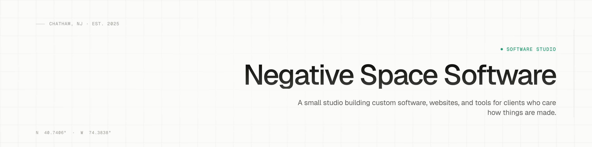

  

<h3 align="center">A small studio building custom software, websites, and tools for clients who care how things are made.</h3>

  Chatham, NJ &nbsp;·&nbsp; Est. 2025 &nbsp;·&nbsp; <a href="https://negativespace.software">negativespace.software&nbsp;→</a>

---

### Selected work

Used invisibly by:

| Client | What we built |
| --- | --- |
| [**mcbproductions.com**](https://mcbproductions.com) | Brand site · Booking flow |
| [**deathvalleyav.com**](https://deathvalleyav.com) | Service site · Equipment catalog |
| [**clemsonpikapps.org**](https://clemsonpikapps.org) | Org site · Member portal |
| [**porschelaneband.com**](https://porschelaneband.com) | Band site · Tour & releases |

### In-house tools

We make our own software, too. Same principles as the client work — buy once, own forever.

- **Notecognito** — A focused notes app. One window, one purpose. &nbsp;·&nbsp; *$31.99 · macOS, Windows in beta*
- **Canvas CLI** — Canvas LMS in your terminal. &nbsp;·&nbsp; *Free · MIT · Open source*
- **Detextify** — Strip AI residue from prose. Privacy-first. &nbsp;·&nbsp; *$12 · Web app*

### How we work

**001 / Simple** &nbsp;·&nbsp; One job, done well. Every screen earns its place by being used.

**002 / Beautiful** &nbsp;·&nbsp; Interfaces that earn their pixels. Real typography, real spacing, real attention to detail.

**003 / Owned** &nbsp;·&nbsp; You own what we build. No proprietary lock-in, no surveillance, no surprise dependencies.

---

### Have something worth building?

We take on a small number of projects each quarter and reply to every inquiry within two business days.

**[hello@negativespace.software&nbsp;→](mailto:hello@negativespace.software)**
